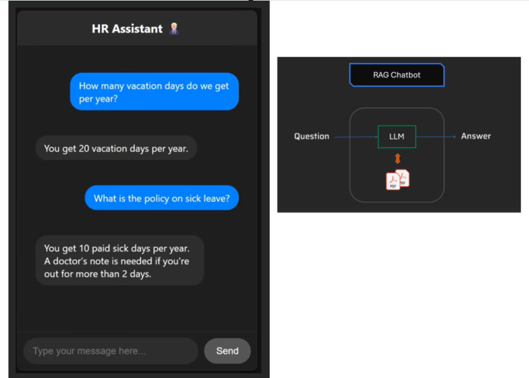
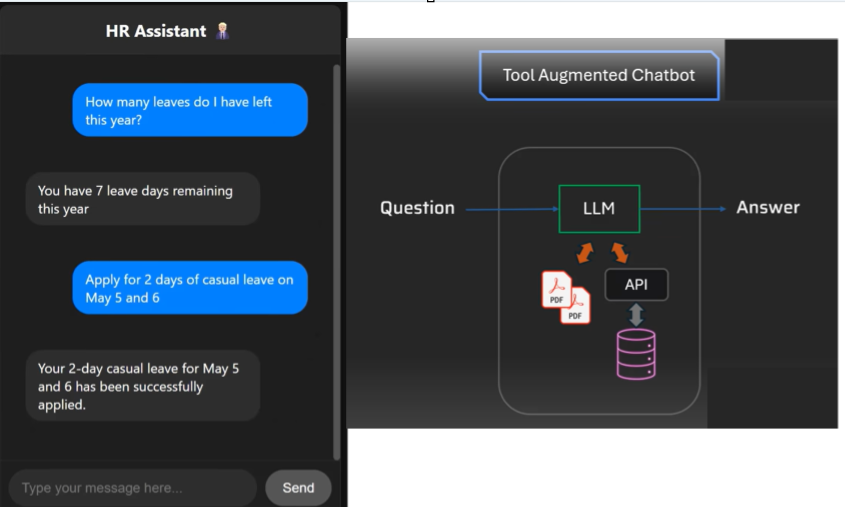
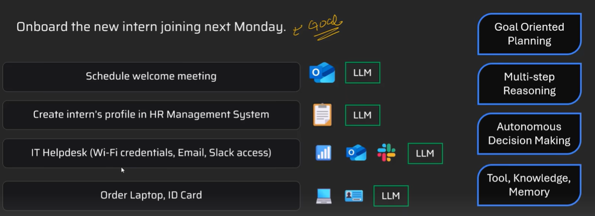
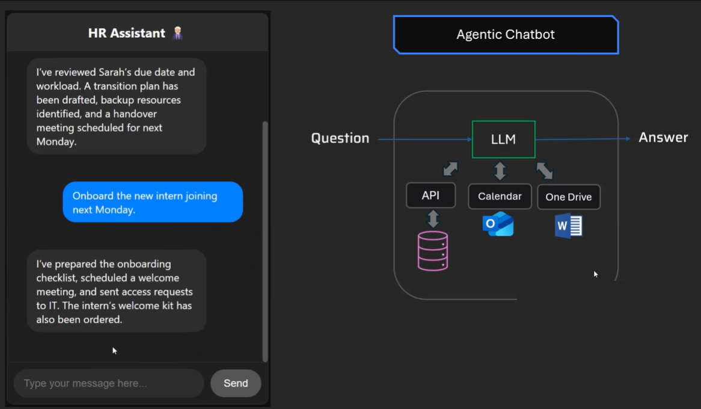

# Agentic AI

## Real-Life Example: Building an HR Assistant

We'll start with a real-life example, we want to build an HR assistant that can answer simple questions about policies, such as:
- How many vacation days do they have per year?
- What is the policy on sick leave?

For this, we have all policy data available in PDF files. You can build a Retrieval Augmented Generation (RAG) chatbot that can simply pull information from these PDFs and answer these questions.

**Is this agentic AI?** The answer is **no**.



Anthropic has a document on [building effective agents](https://www.anthropic.com/engineering/building-effective-agents), and they categorize AI applications into two categories: **workflows** and **agents**. This RAG-based chatbot is actually a workflow—it is not agentic.

## Advancing the Chatbot: Adding Tool Integration

Let's advance this chatbot a bit more and add support where you can ask questions like: "How many leaves do I have left?" Specifically, as an employee, you can also apply for leaves right here.

This is important—this is not just question and answer. **You are taking actions**.

Here, you obviously have access to your policy data via PDFs, but on top of that, you've integrated the LLM with an HR management system through their APIs, where you can:
- Pull leave data for a given employee
- Apply for leave

The system will detect your login, identify whether you are John Sharma or Abdul Kadir (whoever you are), and take the necessary action.



**Do we call this agentic AI?** Well, the answer is again **no**. This is a **tool-augmented chatbot**.

## True Agentic AI: Complex Goal-Oriented Tasks

We want to advance this further and give it goals such as:
- "Prepare for Sara's maternity leave"
- "Onboard the new intern joining next Monday"

This requires **multi-step reasoning** and **multi-turn planning**. This is a broader goal—not a simple task, but a complex task that requires multi-step reasoning.

### Example: Onboarding Process

For onboarding a new intern, the system would:

1. **Schedule a welcome meeting** with the intern and send the meeting invite via Outlook or whatever calendar system you're using

2. **Create the intern's profile** in the HR management system through API integration

3. **Generate content** using the LLM (for example, writing descriptions for meetings)

4. **Create a ticket in IT helpdesk** to get Wi-Fi credentials, email access, Slack access, etc., for that particular intern. Again, here the LLM plays a role, and you have integration with multiple tools such as Slack, Outlook, your Wi-Fi system, and so on.

5. **Order a laptop** through some kind of inventory management system or IT support desk where you can issue ID cards, order laptops, and so on.

**This is agentic AI, folks.** It requires multi-step reasoning, multi-step planning, and in each of these steps, LLMs are involved along with APIs, tools, knowledge, memory, and so on.



## Characteristics of Agentic AI Systems

If you describe a few characteristics of agentic AI systems:

### 1. Goal-Oriented Planning
You are not giving a task such as "tell me how many leaves I have left"—that's a simple task. You are giving a complex task that requires reasoning as well as multi-step planning.

### 2. Multi-Step Reasoning
The system needs to break down complex goals into logical steps.

### 3. Autonomous Decision Making
The system will send emails, send invites for meetings—all of that it is doing autonomously. It is not saying "go to Outlook, click this button." It is actually doing that work. It is performing actions for you.

### 4. Access to Tools
Integration with tools like Outlook, HR management systems, and so on.

### 5. Knowledge Access
Access to PDF files, databases, and so on.

### 6. Memory
When you are having a conversation, it will have context and remember things.

This is an agentic chatbot. Any AI system that you are building that has autonomy—it has some kind of agency where it can make certain decisions and take certain actions on its own, plus it has multi-step complex reasoning and planning—that system is called agentic AI.

## Simple Definition

If I have to put it in a very simple definition: **Agentic AI is an AI system that can make decisions and take actions on its own to achieve a goal without being told exactly what to do at every step.**



## Comparison Table

Here is a table summarizing the capabilities of all three chatbots:

| Feature | RAG-Based Chatbot | Tool-Augmented Chatbot | Agentic AI System |
|---------|-------------------|------------------------|-------------------|
| **Type** | Reactive (Q&A) | Reactive + Tool Usage | Proactive + Reasoning |
| **Tool Usage** | ❌ | ✅ | ✅ |
| **Reasoning** | ❌ | ❌ | ✅ |
| **Planning** | ❌ | ❌ | ✅ |
| **Autonomy** | ❌ | Limited | ✅ |

The RAG-based chatbot is reactive, meaning it's more like Q&A—you ask a question, it responds, but it doesn't have tool usage, reasoning, etc.

The tool-augmented chatbot is reactive and also has access to tools, but it cannot reason, plan, and be proactive.

Whereas the agentic AI system has all these characteristics.

## Examples of Agentic AI Systems

### AI Coding
If you're using Lovable or Replit to create a React Native app similar to a to-do list, it will:
1. First figure out what kind of features a to-do list has
2. Do multi-step planning
3. Write code
4. Execute the code
5. Debug and fix issues
6. Write code again, execute it, and so on

AI coding done through Lovable, Replit, etc., is an example of an agentic AI system.

### Travel Assistant
You might have a travel assistant where you can say: "Book a 7-day trip to London in May where the weather is sunny for at least 4 days" (this is usually my criteria—whenever I go anywhere, I want the weather to be sunny) and you have some budget constraints.

If you have built an agentic AI system, it will:
1. First prepare a plan (like how DeepSeek creates that plan, or any other reasoning model)
2. Execute that plan step by step with the help of all the tools and APIs you have integrated

In this particular system, I might have integrated:
- AccuWeather API for weather
- Expedia API for booking flights
- And so on

## Code Example: Equity Research Agent

Here is a small example of an agentic AI system where you are writing an agent to assist an equity research analyst. They usually write reports on companies.

Here you are giving a goal—you are not giving the exact steps: "Write a report on NVIDIA."

You're also giving it access to:
- Yahoo Finance tool
- Reasoning tools
- DuckDuckGo search
- And so on

Here we are using the AgnoOS framework. You can just run `pip install agno` and run this code. This code is available in the video description below.

```python
# Example code structure (simplified)
import agno

agent = agno.Agent(
    goal="Write a report on NVIDIA",
    tools=["yahoo_finance", "reasoning_tools", "duckduckgo_search"],
    model="gemini"
)

agent.run()
```

When I run this, I'm using Gemini as a model here. What it will do is look at this goal and do multi-step reasoning and planning, then execute those steps.

It does reasoning: "I need to gather this much information. Here is my reasoning." Then step number two: "Compile a report." You need to perform all these steps like:
- Getting company info
- Analyst recommendations
- Company news

So it is doing all of that step by step and generating this comprehensive report which has:
- Key statistics for that company
- Analyst recommendations (one of the common things you'll find in any equity research report)
- Recent news as well

I did not say "have news at the bottom, have analyst recommendations," and so on. It figured it out on its own.

## Low-Code/No-Code Solutions

You don't have to always write code. You can use low-code or no-code tools such as **Zapier**.

Here they are showing a Claude integration with their Zapier MCP server, and you have connected all these tools. Now you're saying things like "What's on my calendar?" It will:
- Access the calendar tool
- Tell you what you have

Then you can have some other task. Here it is showing me the calendar items. Then you can say "Can you tell me more about this particular thing?" and it will call the appropriate tool and tell you "Leo is a CEO at whatever company."

These are simple tasks, but you can have complex tasks. You can use a reasoning model and design your MCP server such that it can handle those multi-step reasoning processes.

### N8N Platform

The other tool I want to mention, which is similar to Zapier, is **N8N**, where you can do drag and drop essentially.

Here, let's say you are doing "create user form submission," and then it will trigger this AI agent which has:
- Anthropic chat model
- Postgres chat memory
- Access to Jira, Microsoft Entra ID, and so on

Then you can define these kinds of workflows. You can create:
- RAG-based systems
- Tool-augmented systems
- Or even agentic AI

For agentic AI, this AI agent piece is going to be important. The kind of prompt that you write can make it solve really complex issues using reasoning models such as GPT-4o.

## Common Questions

### What is the difference between AI Agent and Agentic AI?

Well, you see this diagram—this is a diagram of an agentic AI system in N8N. Any agentic AI system will have **one or more agents**. Here you have this one agent. You can have multiple agents, but you need at least one AI agent with that agentic complex reasoning behavior.

### What is the difference between Gen AI and Agentic AI?

**Generative AI is part of agentic AI.** You see this Google Gemini model—this model might generate some text, write emails, summarize something. It will have all those generation capabilities, and it is one of the components in your agentic AI system.

**Generative AI** is related to generating new data, text, video, images, and so on. You can have that as a subcomponent within your agentic AI system.

## Additional Resources

If you want to see some real project examples along with the code for RAG and tool-augmented AI systems, then I have two different videos. We have given all the code:
- Cold email generator
- MCP for HR leave management

I would also suggest you read the "Building Effective Agents"
 guide by Anthropic. They have mentioned various design patterns:

### Workflow-Based Design Pattern
Where you have a chatbot and the question might be routed to:
- Technical support team
- Sales team
- Some other team

In that case, you can have an LLM as a router and then individual LLMs for each team (sales team, technical team, and so on). Everything is hardwired through code here. So this is a workflow.

### Other Workflow Examples
- Individual tasks using LLMs and then aggregate them
- Orchestrator-based workers (also a workflow)

### Agents Pattern
For agents, there will be this kind of loop: **Action → Feedback → Action → Feedback**—multi-step reasoning, multi-step planning.

## Conclusion

Folks, I hope now it is clear what exactly is agentic AI. It's just a jargon. The idea is really simple. Please check the video description for the code and other resources.

# AI Agent Planning Failures and Mitigation Techniques

## Why Agents Fail in Planning

AI agents are designed to be more than simple chatbots—they plan, reason, and take actions toward goals. However, this complexity introduces multiple failure points:

### Common Planning Failures

1. **Goal Ambiguity**: When objectives are underspecified, agents may optimize for the wrong outcomes
2. **Hallucinated Reasoning**: The underlying LLM can generate confident but incorrect plans
3. **Tool Misuse**: Agents may select inappropriate APIs or execute steps in the wrong sequence
4. **Context Loss**: Forgetting previous steps or failing to pass results correctly between actions
5. **Infinite Loops**: Getting stuck repeating failed actions without learning
6. **Over-ambitious Goals**: Planning tasks beyond their actual capabilities

## Mitigation Techniques with Framework Examples

### 1. Guardrails and Constraints

**Purpose**: Define boundaries for what agents can and cannot do

**Implementation Approaches**:
- **Prompt-level guardrails**: Natural language instructions about acceptable behavior
- **Runtime validation**: Programmatic checks using tools like Guardrails AI and Pydantic

#### LangChain Example
```python
from langchain.agents import initialize_agent, Tool
from langchain.output_parsers import PydanticOutputParser
from pydantic import BaseModel, constr

# Define structured output schema
class SummaryOutput(BaseModel):
    summary: constr(max_length=300)
    sentiment: str
    confidence: float

# Create tools with explicit constraints
tools = [
    Tool(
        name="DatabaseQuery",
        func=query_database,
        description="Only use for structured data retrieval. DO NOT attempt creative writing."
    )
]

parser = PydanticOutputParser(pydantic_object=SummaryOutput)
agent = initialize_agent(
    tools, 
    llm, 
    agent="zero-shot-react-description",
    verbose=True
)
```

### 2. Human-in-the-Loop (HITL)

**Purpose**: Insert human approval checkpoints for critical decisions

#### CrewAI Example
```python
from crewai import Crew, Agent

planner = Agent("Planner", role="Break down complex goals into actionable tasks")
executor = Agent("Executor", role="Execute approved tasks only")
supervisor = Agent("Supervisor", role="Review and approve plans before execution")

crew = Crew(
    agents=[planner, executor, supervisor],
    process="sequential"  # Ensures supervisor approval before execution
)

result = crew.kickoff("Analyze competitor pricing and suggest our new pricing strategy")
```

### 3. Multi-Agent Reflection and Critique

**Purpose**: Use multiple agents to check each other's reasoning

#### AutoGen Example
```python
from autogen import AssistantAgent, UserProxyAgent

planner_agent = AssistantAgent(
    "planner",
    llm_config={"temperature": 0},
    system_message="You create detailed plans to achieve goals."
)

critic_agent = AssistantAgent(
    "critic", 
    llm_config={"temperature": 0},
    system_message="You review plans for logical flaws and missing steps."
)

user_proxy = UserProxyAgent("user")

# Create reflection loop
planner_agent.initiate_chat(
    critic_agent,
    message="Plan a data pipeline to analyze customer sentiment from reviews"
)
```

### 4. Error Handling and Retry Logic

**Purpose**: Gracefully handle failures with bounded retry attempts

#### LangChain AgentExecutor Example
```python
from langchain.agents import AgentExecutor

executor = AgentExecutor(
    agent=agent,
    tools=tools,
    verbose=True,
    max_iterations=3,  # Prevent infinite loops
    max_execution_time=300,  # 5-minute timeout
    early_stopping_method="generate"  # Stop on first valid output
)

# Add custom error handling
try:
    result = executor.run("Find top 5 AI startups and analyze their funding")
except Exception as e:
    print(f"Agent execution failed: {e}")
    # Fallback to simpler approach or human escalation
```

### 5. Sandboxing and Safety Measures

**Purpose**: Limit agent actions to safe, controlled environments

#### Implementation Strategies
- **API Rate Limiting**: Prevent excessive external calls
- **File System Restrictions**: Limit read/write access
- **Staged Execution**: Test in staging before production
- **Resource Quotas**: Limit computational resources

```python
# Example sandbox configuration
sandbox_config = {
    "max_api_calls_per_minute": 10,
    "allowed_domains": ["api.company.com", "internal-kb.com"],
    "max_execution_time": 600,
    "allowed_file_paths": ["/tmp/agent_workspace/"],
}
```

### 6. Monitoring and Rollback Mechanisms

**Purpose**: Track agent actions and enable recovery from failures

```python
import logging
from contextlib import contextmanager

@contextmanager
def agent_transaction():
    """Context manager for safe agent operations with rollback capability"""
    checkpoint = create_checkpoint()
    try:
        yield
        commit_changes()
    except Exception as e:
        logging.error(f"Agent action failed: {e}")
        rollback_to_checkpoint(checkpoint)
        raise

# Usage
with agent_transaction():
    agent.execute_plan()
```

## Real-World Example: Financial Analysis Agent

**Scenario**: Agent tasked with "Analyze our quarterly performance and recommend investment strategies"

### Potential Failures Without Guardrails
- Accessing unauthorized financial data
- Making investment recommendations beyond its scope
- Hallucinating financial figures
- Infinite loops when market data APIs fail

### Mitigation Implementation

#### LangChain with Multiple Guardrails
```python
from langchain.agents import create_openai_functions_agent
from guardrails import Guard, OnFailAction
import guardrails as gd

# Define output schema with Guardrails AI
guard = Guard.from_pydantic(
    output_class=FinancialAnalysis,
    prompt="Analyze quarterly performance data",
    on_fail=OnFailAction.REASK  # Retry on validation failure
)

# Create tools with explicit constraints
financial_tools = [
    Tool(
        name="QuarterlyDataRetrieval",
        func=get_quarterly_data,
        description="Retrieve ONLY current quarter data. Never extrapolate future predictions."
    ),
    Tool(
        name="BenchmarkComparison", 
        func=compare_benchmarks,
        description="Compare against industry benchmarks. Flag any data quality issues."
    )
]

# Initialize agent with safety measures
agent = create_openai_functions_agent(
    llm=llm,
    tools=financial_tools,
    prompt=financial_analysis_prompt
)

executor = AgentExecutor(
    agent=agent,
    tools=financial_tools,
    max_iterations=5,
    return_intermediate_steps=True,
    handle_parsing_errors=True
)
```

#### CrewAI Multi-Agent Approach
```python
data_analyst = Agent(
    role="Financial Data Analyst",
    goal="Extract and validate quarterly financial metrics",
    backstory="Expert in financial data analysis with strict accuracy requirements"
)

risk_assessor = Agent(
    role="Risk Assessment Specialist", 
    goal="Evaluate risks in any recommendations",
    backstory="Conservative risk analyst who flags potential issues"
)

report_writer = Agent(
    role="Financial Report Writer",
    goal="Create executive summary with clear disclaimers",
    backstory="Experienced in writing compliant financial reports"
)

crew = Crew(
    agents=[data_analyst, risk_assessor, report_writer],
    tasks=[data_extraction_task, risk_analysis_task, report_generation_task],
    verbose=True
)
```

## Best Practices Summary

1. **Always specify clear constraints** in agent descriptions and system prompts
2. **Implement runtime validation** using Pydantic schemas or Guardrails AI
3. **Use multi-agent systems** for complex tasks requiring multiple perspectives
4. **Add human checkpoints** for high-stakes decisions
5. **Implement comprehensive logging** to track agent decision-making
6. **Set reasonable bounds** on iterations, time, and resource usage
7. **Test in safe environments** before production deployment
8. **Plan for failure recovery** with rollback mechanisms

## Key Takeaway

Agent planning failures are inevitable, but they can be effectively managed through layered safety measures. The combination of prompt engineering, runtime validation, multi-agent collaboration, and human oversight creates robust systems that can handle the complexity of real-world tasks while minimizing risks.

Rather than expecting perfect planning, successful AI agent implementations focus on graceful failure handling and continuous improvement based on observed failure modes.