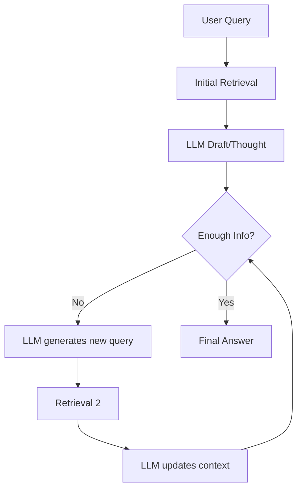

# 🔧 Design Patterns in RAG


## `1. 📚 Classic RAG: Single-pass Retrieval + Generation`

Classic RAG (Retrieval-Augmented Generation) is the **baseline architecture** for building knowledge-augmented LLM systems. It combines **retrieval from a vector database** and **generation by a language model**, but does so in a **single-pass** without iterative reasoning.

---

## 🔧 Architecture Overview

Classic RAG follows a **single-pass** structure:

1. **Embed the User Query**
2. **Retrieve Relevant Chunks**
3. **Concatenate Chunks + Query → Prompt**
4. **Generate Answer**

---

## ✅ Functional Flow

### 🔹 Step 1: User Query

Example:

```plaintext
"What are the side effects of aspirin?"
```

---

### 🔹 Step 2: Embed the Query

Convert the query into a vector:

```python
query_vector = embedding_model.embed("What are the side effects of aspirin?")
```

---

### 🔹 Step 3: Retrieve Relevant Chunks

Use a vector store to find the most relevant context:

```python
top_k_chunks = vector_store.similarity_search(query_vector, k=5)
```

Example Retrieved Chunks:

1. "Aspirin may cause gastrointestinal irritation, ulcers, and bleeding."
2. "It is not recommended for children due to risk of Reye’s syndrome."
3. "Common side effects include nausea, rash, and dizziness."

---

### 🔹 Step 4: Build the Prompt

Combine chunks and the query:

```plaintext
[Context]:

1. Aspirin may cause gastrointestinal irritation, ulcers, and bleeding.
2. It is not recommended for children due to risk of Reye’s syndrome.
3. Common side effects include nausea, rash, and dizziness.

[Question]:
What are the side effects of aspirin?

[Answer]:
```

---

### 🔹 Step 5: Generate the Answer

```python
llm(prompt) → "Common side effects of aspirin include nausea, stomach irritation, ulcers, and bleeding. It should not be given to children."
```

---

## ✅ Characteristics of Classic RAG

| Feature                        | Description |
|-------------------------------|-------------|
| **Retrieval Pass**            | Single-pass: Retrieval happens **only once** |
| **Context Injection**         | Retrieved chunks are **directly concatenated** with the prompt |
| **No Feedback Loop**          | Generation does **not influence retrieval** |
| **Fast & Simple**             | Lightweight and easy to implement |
| **Limited Reasoning**         | Can struggle with multi-hop or cross-document reasoning |
| **Context Limit**             | Bound by model's max token window |

---

## 🧠 Real-World Example

### 💬 User Question:
> "When was Tesla founded and who are the key people involved?"

### 🔍 Retrieval:
- "Tesla was founded in 2003 by engineers Martin Eberhard and Marc Tarpenning."
- "Elon Musk joined Tesla as an early investor and became chairman in 2004."

### 🧾 Prompt:
```plaintext
Tesla was founded in 2003 by engineers Martin Eberhard and Marc Tarpenning.
Elon Musk joined Tesla as an early investor and became chairman in 2004.

Question: When was Tesla founded and who are the key people involved?
```

### 🧠 Generated Answer:
> "Tesla was founded in 2003 by Martin Eberhard and Marc Tarpenning. Elon Musk later joined as an investor and chairman."

---

## 🔁 Assumptions & Limitations

### ❗ Assumptions
- Relevant context is retrieved correctly.
- All necessary info fits in the prompt window.

### ⚠️ Limitations
- ❌ No iterative improvement
- ❌ No retrieval reasoning or feedback
- ❌ Limited to model's context size
- ❌ Multi-hop questions often fail

---

## ✅ When to Use Classic RAG

**Best For:**
- FAQ bots
- Customer support agents
- Lightweight chatbots
- Fast retrieval with low cost

**Avoid For:**
- Multi-hop QA
- Deep summarization
- Tasks with sparse documents

---

## ✅ Summary Table

| Component         | Description |
|------------------|-------------|
| **Retrieval**     | One-time semantic search for top-k chunks |
| **Prompt**        | Context + User Query |
| **LLM**           | Generates answer in a single pass |
| **Feedback**      | None (no retrieval refinement) |
| **Simplicity**    | ✅ Easy to implement |
| **Limitations**   | ❌ Reasoning, ❌ Feedback, ❌ Long Contexts |

---

## 🧠 Want to Go Deeper?

Explore:
- **Multi-hop RAG**
- **RAG with Feedback Loops**
- **Chunking Strategies**
- **Re-ranking + Hybrid Search**

---


## `📘 2. Iterative RAG (Multi-turn with Feedback)`

**Iterative RAG**, also known as **multi-turn RAG** or **RAG with feedback**, improves upon Classic RAG by incorporating **a feedback loop** between the language model (LLM) and the retriever. It allows for **multi-hop reasoning**, **retrieval refinement**, and **better factual grounding** over multiple passes.

---

## 🔁 Key Idea

Instead of performing a **single retrieval**, the LLM is allowed to **influence future retrievals** based on its **intermediate thoughts or information needs**.

This is akin to a human researcher reading some context, realizing they need more info, and then issuing a better query.

---

## 🛠️ Architecture Overview

1. **Initial Query Embedding → Retrieval → Context → Generation**
2. **LLM Reflects: “Do I have enough info?”**
3. **If not → Formulates a follow-up query or search intent**
4. **Repeat Retrieval with updated query**
5. **Combine all retrieved knowledge → Final Generation**



---

## ✅ Functional Flow

### Step 1: Initial Query
```plaintext
"Why was Tesla's stock so volatile in 2020?"
```

---

### Step 2: First Retrieval

Retrieves general info:
- Tesla’s stock tripled in 2020.
- Increased retail investor interest.
- Inclusion in S&P 500.

---

### Step 3: LLM Thinks

**LLM Response (Intermediate Thought):**
> “I need more data about the timeline of events and key financial triggers.”

---

### Step 4: Follow-up Query

**LLM-Generated Query:**
> “Major events affecting Tesla stock price in 2020”

---

### Step 5: Second Retrieval

- Q1 earnings beat estimates.
- Battery Day in September.
- S&P 500 inclusion announced in Nov.

---

### Step 6: Final Answer Generation

LLM now generates:
> "Tesla’s stock was volatile in 2020 due to several major catalysts: strong earnings reports, investor hype from Battery Day, and its inclusion in the S&P 500 index."

---

## 🧠 Why Iterative RAG?

| Classic RAG                      | Iterative RAG                        |
|----------------------------------|--------------------------------------|
| One-shot retrieval               | Multi-round feedback loop            |
| Good for simple QA              | Better for multi-hop reasoning       |
| No self-reflection               | Model can assess and refine queries |
| Faster, but less flexible        | Slower, but more accurate           |

---

## ⚙️ Implementation Strategies

### 🔹 Method 1: Self-ask-with-search

- LLM is prompted to break complex questions into sub-questions.
- Each sub-question is answered via retrieval.
- Final synthesis is generated at the end.

Example Prompt:
```plaintext
Question: Why did the Roman Empire fall?
Thought: Let’s break it down.
Sub-question 1: What were the political reasons?
Sub-question 2: What were the economic reasons?
...
```

---

### 🔹 Method 2: Chain-of-Thought Prompting with Retrieval

- Model is allowed to “think aloud”
- After each thought, retrieval is performed to fetch more information

Example:
```plaintext
Thought: I need to understand the economic impact of WWII on Germany.
→ Retrieval
Thought: Now I need to know how that led to hyperinflation.
→ Retrieval
Final Answer...
```

---

### 🔹 Method 3: ReAct (Reasoning + Acting)

LLM outputs both **thoughts** and **actions** like:

```plaintext
Thought: I need to know the cause of Tesla stock volatility.
Action: Search[“Tesla stock movement 2020”]
Observation: Found articles about S&P inclusion and Battery Day.
...
Final Answer: ...
```

---

## 🧪 Example: Multi-hop Question

### Question:
> "What impact did COVID-19 have on the education system in India?"

### Iterative Thought Chain:

1. **Retrieve:** COVID-19 impact on schools in India  
2. **LLM Thought:** What about access to online education?  
3. **Retrieve:** Data on internet access by region  
4. **LLM Thought:** Were any government initiatives launched?  
5. **Retrieve:** Government schemes (PM eVidya, DIKSHA)  
6. **Generate Answer:** Synthesized view

---

## 🚧 Challenges

| Challenge                     | Description |
|------------------------------|-------------|
| **Latency**                  | Multi-turn increases API calls |
| **Cost**                     | More tokens and retrievals |
| **Complexity**               | Harder to implement than Classic RAG |
| **Query Drift**              | LLM-generated queries may go off-topic |

---

## ✅ When to Use Iterative RAG

**Ideal For:**
- Multi-hop QA
- Research assistants
- Agents with tool-use (search, calculators)
- Legal, medical, academic summaries

**Avoid If:**
- You need real-time latency
- Costs are tightly constrained

---

## ✅ Summary Table

| Component           | Description |
|--------------------|-------------|
| **Retrieval**       | Multiple rounds, conditional |
| **LLM Role**        | Thinks, reflects, guides search |
| **Feedback Loop**   | Yes |
| **Query Refinement**| Yes |
| **Reasoning**       | Deep, multi-hop |
| **Best For**        | Complex QA, assistant agents |
| **Limitations**     | Cost, latency, complexity |
