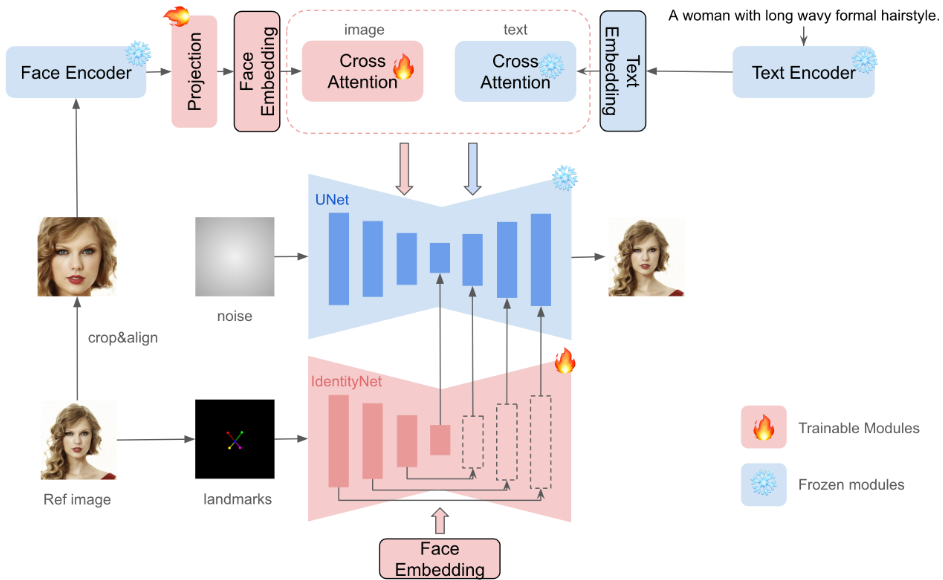

# Adapters in Image Generation: Modular Intelligence for Visual AI

## Introduction: The Parameter Efficiency Revolution

In the rapidly evolving landscape of generative AI, we face a fundamental challenge: how do we customize massive pretrained models for specific tasks without the computational overhead of full fine-tuning? The answer lies in **adapters** – elegant, modular solutions that have transformed how we approach image generation.

---

## What Are Adapters? The Modular Paradigm

Adapters represent a paradigm shift from monolithic model training to modular intelligence. At their core, adapters are:

A lightweight, modular component that adds new capabilities to a large pre-trained model without modifying its original weights.

In other words, they are **small neural network modules** inserted into frozen backbone models that learn task-specific representations while preserving the general knowledge of the pretrained system. Rather than modifying millions of parameters, adapters typically introduce only thousands of new parameters, achieving remarkable efficiency gains.

### The Three Pillars of Adapter Theory

1. **Parameter Efficiency**: Learn minimal parameters while maximizing task performance
2. **Modularity**: Enable plug-and-play functionality across diverse applications  
3. **Composability**: Allow multiple adapters to work in harmony

This approach originated in natural language processing with BERT adapters but has found profound applications in computer vision, particularly in generative models like Stable Diffusion.

---

## Real-World Tasks Enabled by Adapters in Image Generation

1. **Pose-guided generation**: Adapters use pose skeletons to control how people or animals appear and move in the image.

2. **Depth-aware synthesis**: Using depth maps as structure guides, models generate scenes with accurate 3D geometry.

3. **Semantic segmentation-to-image**: Turn labeled masks (like "sky", "road", "tree") into photorealistic scenes.

4. **Sketch-to-image**: Rough human-drawn sketches guide the model to generate polished, high-resolution artwork.

5. **Style conditioning**: Apply a specific art style (anime, oil painting, cyberpunk) across any image using style-specific adapters.

6. **Subject preservation**: Personalize the model to generate consistent images of a particular face, object, or brand identity.

---

## Theoretical Foundations: Why Adapters Work

### 1. The Linear Subspace Hypothesis
Adapters operate on the principle that task-specific knowledge often lies within low-dimensional subspaces of the model's representation space. Rather than learning entirely new representations, adapters learn to navigate these subspaces efficiently.

```plaintext
Think of a large pretrained image model as a vast museum with countless artistic styles hidden inside. The Linear Subspace Hypothesis suggests that each specific task—like anime faces or medical scans—resides in a small, low-dimensional corridor within this space. Adapters act like compact, task-specific maps that guide the model efficiently to these hidden corridors without changing the whole structure. Instead of retraining the entire model, adapters learn minimal adjustments to unlock specific abilities already embedded within the model’s latent space.
```

### 2. Residual Learning Framework  
Adapters function as residual connections to pretrained features, learning **adjustments** rather than replacements. This preserves the rich representations learned during pretraining while enabling task-specific customization.

```plaintext
Imagine a pretrained painter who already knows how to paint anything with great skill. Now, instead of retraining them from scratch to paint in a new style or domain, you give them a small guidebook — an adapter — that says: “Just tweak your brushstroke here, or adjust your shading there.” This is the essence of the Residual Learning Framework: adapters don’t replace existing skills — they learn small residual adjustments. They preserve the painter’s (i.e., model’s) core abilities while adding task-specific refinements efficiently.
```

### 3. The Modularity Principle
Like software plugins, each adapter specializes in a particular aspect of generation – style, identity, pose, or semantic control – enabling unprecedented flexibility in model customization.

```plaintext
Think of adapters like software plugins for a powerful image generation engine. Each plugin (adapter) handles a specific task — one for style, another for identity, a third for pose, and so on. This follows the Modularity Principle: instead of changing the whole system, you just plug in what you need. It enables flexible, composable control over generation — like mixing and matching tools for custom results.
```

---

## 🧩 Types of Adapters in Image Generation – Synthesized Overview

### 1. LoRA (Low-Rank Adaptation)

Efficiently fine-tunes large models by injecting low-rank matrices into **linear layers**. Instead of fine-tuning all the large model weights (e.g., in *UNet* for image generation OR *Transformers* for text generation), LoRA freezes the base model and injects small trainable rank-decomposition matrices into specific layers (typically attention layers).

In standard attention:

```plaintext
Q, K, V = Linear(input)
```

With LoRA injected:

```plaintext
Q = Linear(input) + LoRA_Q(input)
K = Linear(input) + LoRA_K(input)
```
Where `LoRA_Q(input)` = `A @ B @ input` — small-rank matrices (`A` and `B`) that are only a few parameters.
> So the original `Linear` layer is untouched — LoRA just adds extra trainable paths, which you can turn **on/off**.

LoRA fine-tunes **small trainable layers** added to a **frozen base model** (e.g., Stable Diffusion’s UNet).  
To train these adapters meaningfully, you usually need **multiple examples** that capture the target concept across **variations**.

### 📸 For Image Generation Tasks (like personalization or identity learning):

| Use Case                        | Dataset Required                                          |
|---------------------------------|-----------------------------------------------------------|
| LoRA for a person *(e.g., your face)*     | 3–10 high-quality images (different angles, lighting, expressions) |
| LoRA for a style *(e.g., Van Gogh)*       | 20–100+ images in that style                             |
| LoRA for an object/character     | 5–30 images from multiple views                          |

> 🧪 LoRA generalizes much better than full fine-tuning — but still needs more than one image to avoid overfitting or lack of generalization.

### 📌 Summary

- 🏗️ **How**: Updates weights as ΔW = B·A (low-rank matrices)
- 🎯 **Used for**: Style transfer (e.g., Van Gogh, Cyberpunk), personalization (e.g., DreamBooth), domain adaptation (e.g., manga to real-world), fine-grained aesthetic tuning
- 🧠 **Intuition**: Like installing tiny tuning knobs on specific parts of a giant engine — adjust without rebuilding.

### 🏆 Notable Implementations
- **DreamShaper LoRA** — adds cinematic lighting & color grading to Stable Diffusion outputs *(Microsoft Research, 2021 for NLP; adapted by SD community in 2022)*.  
- **Anime Style LoRA** — converts any prompt into anime-style art *(CivitAI creators, 2022)*.  
- **Realistic Faces LoRA** — boosts photorealism in portraits *(Stable Diffusion community, 2023)*.  


```plaintext
🔎 Related: "DreamBooth" which is a fine-tuning technique developed by Google Research and Boston University personalizes a pre-trained diffusion model (like Stable Diffusion) by updating its original weights using a small set of subject-specific images — typically 3 to 5 high-quality images. Training can take 30 minutes to a few hours depending on GPU and settings. Unlike LoRA, which adds small adapters without altering the base model, DreamBooth directly modifies the model weights, making it powerful but less modular and more resource-intensive.
```


### 2. T2I Adapters (Text-to-Image Adapters)

A **lightweight conditioning module** that injects **control signals** (e.g., pose, depth, segmentation, sketches) into a pre-trained image generation model (like Stable Diffusion) **without retraining the core model**.  

Instead of replacing the UNet or retraining it from scratch, T2I Adapters **project the control input** into the **same feature space** as the UNet’s intermediate activations and merge them during the denoising steps.

In standard Stable Diffusion:

```plaintext
Noise → UNet → Denoised Latents
```

```plaintext
Control Map → Adapter → Feature Injection → UNet → Denoised Latents
```

The adapter typically consists of **a few convolutional layers** that align the control input to the spatial resolution and channel depth of the UNet’s feature maps.  
The control signal is then **added or concatenated** into the UNet at multiple layers.

### 📸 For Image Generation Tasks

| Control Type         | Example Use Case                                                                 |
|----------------------|----------------------------------------------------------------------------------|
| **Pose (OpenPose)**  | Human pose transfer, keep subject posture fixed while changing background/style |
| **Depth Map**        | Preserve scene geometry when changing weather, style, or lighting               |
| **Segmentation Map** | Keep semantic regions fixed while altering appearance (e.g., clothes, walls)    |
| **Edge Map**         | Turn a sketch into a photorealistic or stylized image                           |

### 📌 Summary

- 🏗️ **How**: Projects control input (e.g., pose, depth, segmentation) to UNet feature space via small CNN layers, injects during denoising  
- 🎯 **Used for**: Structure-preserving generation, image-to-image consistency, style transfer with fixed geometry  
- 🧠 **Intuition**: Like giving the model a “trace outline” of what must stay fixed, while letting it improvise the rest

### 🏆 Notable Implementations

- **OpenPose Adapter** — integrates OpenPose skeletal keypoints to control human posture while allowing style/background changes *(developed by ControlNet/T2I Adapter community, adapted from OpenPose by CMU Perceptual Computing Lab)*  
- **MiDaS Depth Adapter** — uses MiDaS depth estimation to preserve scene geometry during style or lighting transformations *(Intel ISL’s MiDaS model integrated into T2I Adapter workflows)*  
- **ADE20K Segmentation Adapter** — applies semantic segmentation maps to maintain object layout while altering textures or colors *(trained on MIT’s ADE20K dataset, implemented in the T2I Adapter framework)*  


### 3. ControlNet (The Conditioning Revolution)

Introduced in early **2023** by *Lvmin Zhang* and collaborators at **Stanford University** and **Tencent ARC Lab**, ControlNet adds **rich structural conditioning** to diffusion models **without altering the original model weights**.

Instead of modifying the existing UNet, ControlNet **duplicates** some of its encoder layers, making them **trainable** for processing external conditioning inputs (e.g., edges, depth maps, poses).  
The frozen original UNet processes the noisy latents as usual, while the trainable ControlNet branch interprets the control signal and injects structure-preserving features into the generation process.

In standard Stable Diffusion:

```plaintext
Noise → UNet → Denoised Latents
```

With ControlNet:

```plaintext
Noise → Frozen UNet + (Trainable Copy for Control Input) → Feature Fusion → Denoised Latents
```

### 📸 For Image Generation Tasks

| Control Type                   | Example Use Case                                                                 |
|--------------------------------|----------------------------------------------------------------------------------|
| **Canny Edge Map**             | Convert edge-detected photos into photorealistic or stylized images              |
| **Scribble**                   | Turn freehand sketches into detailed artworks                                    |
| **Depth Map**                  | Preserve scene geometry while changing style, weather, or lighting               |
| **Pose Skeleton (OpenPose)**   | Keep subject posture fixed while changing clothing, environment, or background   |
| **QR Code**                    | Create artistic QR codes that remain scannable                                   |

### 📌 Summary

- 🏗️ **How**: Duplicates encoder layers of the UNet into a **trainable branch** for conditioning input, merges features into the frozen UNet during denoising  
- 🎯 **Used for**: Edge-to-image, sketch-to-art, depth-to-scene generation, posture preservation, QR code art  
- 🧠 **Intuition**: Like placing *tracing paper* over the model — you define the structure, and it paints in the details.

### 🏆 Notable Implementations

- **Original ControlNet** — *"Adding Conditional Control to Text-to-Image Diffusion Models"* by Lvmin Zhang et al., 2023  
- **Depth ControlNet** — depth-aware style transfer *(trained with Intel ISL’s MiDaS depth estimation)*  
- **QR Code ControlNet** — scannable QR code art *(community-trained adaptation)*  
- **Scribble ControlNet** — transforms freehand drawings into polished outputs *(trained on paired sketch-image datasets)*  


### 4. Style Adapters (The Aesthetic Controllers)

Introduced in mid **2023** by *Tencent ARC Lab* as part of the T2I-Adapter framework, Style Adapters specialize in injecting **consistent artistic or visual styles** into diffusion models **without retraining the full network**.

Instead of modifying the UNet or training from scratch, Style Adapters consist of **lightweight convolutional or attention-based modules** trained on a specific style dataset (e.g., Van Gogh, Studio Ghibli, cinematic film grading).  
During inference, these adapters project a “style embedding” into the **attention layers** of the UNet, influencing color palettes, brush strokes, texture, and overall composition.

In standard Stable Diffusion:

```plaintext
Text Prompt → UNet → Denoised Latents
```

With Style Adapter:

```
Text Prompt + Style Adapter → Style Features Injected into UNet Attention → Denoised Latents
```

### 📸 For Image Generation Tasks

| Style Type           | Example Use Case |
|----------------------|------------------|
| Painterly (Oil, Watercolor) | Turn a normal render into a hand-painted aesthetic |
| Anime/Manga          | Apply Japanese animation style to any scene |
| Cinematic Grading    | Add dramatic lighting, film-like tones, and mood |
| Concept Art          | Generate consistent pre-visualization art for games or films |
| Custom Brand Style   | Align outputs with a brand’s design language |

### 📌 Summary
- **🏗️ How:** Uses small trainable modules that inject learned style features into UNet attention layers.  
- **🎯 Used for:** Consistent aesthetic control, brand/style matching, artistic reinterpretation.  
- **🧠 Intuition:** Like putting a “style filter” directly into the model’s brain — every detail gets seen through that lens.  

### 🏆 Notable Implementations
- **Van Gogh Style Adapter** — trained on paintings to replicate his color palette and brushwork *(Tencent ARC Lab)*  
- **Anime Style Adapter** — converts prompts into anime-style illustrations *(community-trained on Danbooru datasets)*  
- **Cinematic Adapter** — adds film-like lighting and grading *(trained on movie stills)*  
- **Custom Brand Adapter** — matches a company’s visual identity *(enterprise fine-tuning use case)*  


### 5. Identity Adapters (The Face Keepers)

Introduced in late **2023** by *Tencent ARC Lab* and further developed by the open-source community, Identity Adapters focus on **preserving and replicating a specific person’s facial identity** across different poses, styles, and scenes in diffusion-based image generation.

Instead of retraining the entire model, these adapters combine **face embeddings** (from recognition models like ArcFace or InsightFace) with **structural facial landmarks** to guide the UNet during denoising.  
The identity embedding acts as a “person descriptor” injected into the model, ensuring consistent facial geometry and features even when style or background changes drastically.

In standard Stable Diffusion:

```plaintext
Text Prompt → UNet → Denoised Latents
```

With Identity Adapter:

```
Text Prompt + Identity Embedding + Landmarks → Adapter → Feature Injection into UNet → Denoised Latents
```

The adapter typically uses **lightweight MLP or convolutional layers** to align the identity features to the **UNet’s attention layers** or intermediate feature maps.

### 📸 For Image Generation Tasks

| Identity Type                  | Example Use Case                                                                 |
|--------------------------------|----------------------------------------------------------------------------------|
| **Face-Preserving Personalization** | Keep the same person’s face across different outfits or environments              |
| **Photo-to-Cartoon Identity Match** | Convert a portrait into an anime/cartoon style without losing likeness            |
| **Cross-Angle Consistency**         | Maintain identity when generating profile and frontal views                      |
| **Expression Cloning**              | Transfer smiles, frowns, or other expressions while keeping the same face        |
| **Multi-ID Scenes**                  | Generate group shots where each person’s identity is preserved                   |

### 📌 Summary

- 🏗️ **How**: Encodes facial features via face recognition models (e.g., ArcFace) and aligns them with facial landmark geometry; injects identity features into the UNet during denoising.  
- 🎯 **Used for**: Personalization, avatar generation, consistent characters in storytelling, expression transfer.  
- 🧠 **Intuition**: Like giving the model a passport photo and telling it, “No matter what happens, this is the same person — just change the setting, pose, or style.”  

### 🏆 Notable Implementations

- **IP-Adapter FaceID** — ArcFace-based identity preservation adapter for Stable Diffusion *(Tencent ARC Lab, 2023)*  
- **InstantID** — lightweight identity adapter enabling consistent results with minimal input *(Tencent ARC Lab, 2024)*  
- **PhotoMaker** — supports multiple reference images for stronger identity capture *(Tencent ARC Lab, 2024)*  
- **DreamBooth + Identity LoRA** — fine-tunes a model for a specific person using a few high-quality photos *(Google Research, 2022; adapted by SD community)*  
- **Face Encoder + LoRA Hybrid** — community-built pipelines combining open-source face encoders with LoRA adapters for personalization *(SD community)*  


## Case Study: InstantID as an Adapter System

Let's examine [InstantID](https://instantid.github.io/) – a sophisticated identity adapter that exemplifies modern adapter design principles.

Given only **one reference ID image**, **InstantID** aims to generate **customized images** with various **poses or styles** while ensuring **high fidelity** to the source identity.

It incorporates three crucial components **three crucial components**:

1. **ID Embedding**
   - **Source:** Uses the ArcFace face recognition encoder from InsightFace, originally developed by researchers from Imperial College London and Microsoft Asia, trained on large-scale datasets such as MS-Celeb-1M and Glint360K.  

   - **Function in InstantID:** Captures robust semantic facial features — skin tone, eye color, lip shape, jawline, and other cues (e.g., always keeping the person’s brown eyes and square jawline).  

   - This embedding acts as the foundational identity vector, ensuring the generated face matches the reference identity across all outputs.

2. **LoRA-Enhanced UNet with Decoupled Cross-Attention**  
   - **Source:** Built by the InstantID authors.  

   - **Function:** Integrates identity features into the Stable Diffusion UNet using Low-Rank Adaptation (LoRA).  

   - Does not replace or retrain the base UNet — instead, it injects small LoRA modules into the cross-attention layers.  

   - Decoupled cross-attention lets the reference image act as a visual prompt, guiding generation while maintaining identity consistency, all in a modular and efficient way.

3. **IdentityNet (Facial Control Adapter)**  
   - **Source:** Developed by the InstantID team.  

   - **Function:** Encodes detailed spatial features from the reference — such as facial landmarks (eyes, nose tip, jaw outline) and geometry — to control pose and expression in the generated image.  

   - For example: one eyebrow higher than the other, a slightly tilted nose, or a subtle smile can be preserved in new poses.

**Key point:**  

- **ID Embedding = ArcFace encoder** → captures *who* the person is.  
- **IdentityNet = InstantID module** → captures *how* their face is structured and posed.  

Both feed into the LoRA-enhanced Stable Diffusion UNet to generate identity-preserving images without retraining the entire model.


```plaintext
"ID Embeddings" and "IdentityNet" in InstantID do not structurally change the UNet — all its original layers and weights remain untouched.

Instead, InstantID uses LoRA to inject tiny, trainable adapter modules (typically into the cross-attention layers of the UNet), allowing the model to integrate identity and pose information efficiently, without retraining or modifying the full UNet.
```

```plaintext
"ID Embedding" ensures the generated face looks like Shah Rukh Khan — his eyes, smile, overall appearance.

"IdentityNet" captures how his facial features are arranged — like slightly arched eyebrows, a sharp jawline, or the exact spacing between his eyes.
```

### InstantID Architecture



This architecture demonstrates how multiple adapters can work harmoniously, each contributing specialized knowledge to the generation process.

```plaintext
Consider this analogy: If Stable Diffusion is a film production team, then:
- **CLIP(prompt encode model in Stable Diffusion) serves as the script director** – guiding *what* to generate based on text
- **InstantID(the adapter) serves as the casting director** – ensuring *who* appears maintains consistent identity

Both systems condition the same UNet(not re-train the UNet) through cross-attention mechanisms, but from different domains – semantic (language) and visual (identity).
```

## Architectural Integration: Where Adapters Live

### Attention Layer Integration
Most adapters integrate within the attention mechanisms of transformer-based models:
- Cross-attention layers for text-image conditioning
- Self-attention modifications for style adaptation
- Multi-head attention augmentation for control signal injection

### Residual Pathways
Adapters often implement residual connections, allowing the model to learn when to apply adaptations and when to rely on pretrained knowledge.

### Layer-Specific Specialization
Different layers serve different purposes:
- **Early layers**: Low-level feature adaptation (edges, textures)
- **Middle layers**: Structural and compositional changes
- **Late layers**: High-level semantic and style modifications

## The Composability Revolution

One of the most exciting aspects of adapter systems is their composability. Multiple adapters can be combined to achieve complex, multi-faceted control:

- **Style + Identity**: Generate a specific person in a particular artistic style
- **Pose + Expression**: Control both body position and facial expression
- **Lighting + Mood**: Adjust both technical lighting parameters and emotional tone

### Mathematical Framework
Adapter composition often follows additive or multiplicative schemes:
- **Additive**: Final_Output = Base_Model + α₁·Adapter₁ + α₂·Adapter₂
- **Multiplicative**: Final_Output = Base_Model × (1 + α₁·Adapter₁) × (1 + α₂·Adapter₂)

The scaling factors (α) allow fine-grained control over adapter influence.

## Benefits and Impact

### 1. Computational Efficiency
| Aspect | Traditional Fine-tuning | Adapter-based |
|--------|-------------------------|---------------|
| Parameters Modified | Millions | Thousands |
| Training Time | Hours/Days | Minutes/Hours |
| Memory Requirements | Full Model | Minimal Additional |
| Storage per Task | Full Model Copy | Small Adapter File |

### 2. Democratization of AI Customization  
Adapters have democratized AI customization, enabling individual users and small organizations to create personalized AI systems without massive computational resources.

### 3. Research Acceleration
The modular nature of adapters has accelerated research by enabling rapid experimentation with different conditioning signals and control mechanisms.

## Current Challenges and Future Directions

### Technical Challenges
- **Adapter Interference**: When multiple adapters conflict or create unexpected interactions
- **Scaling Laws**: Understanding how adapter performance scales with model size
- **Quality vs. Efficiency Trade-offs**: Balancing adaptation quality with parameter count

### Emerging Frontiers
- **Universal Adapters**: Single adapters that work across multiple model architectures
- **Meta-Adapters**: Adapters that learn to adapt to new tasks with minimal examples
- **Hierarchical Adapter Systems**: Multi-level adapter architectures for complex control

### Applications Beyond Image Generation
- Video generation and editing
- 3D model creation and manipulation  
- Multi-modal generation (text, image, audio)
- Real-time interactive systems

## Conclusion: Embracing the Adapter-First Mindset

As we step into the next era of generative AI, it's time to shift our perspective: from building ever-larger monolithic models to designing modular, adaptable systems. Just as microservices revolutionized software engineering by enabling scalable, maintainable, and composable architectures, adapters are transforming AI development. They offer a blueprint for building efficient, swappable, task-specific modules that unlock new capabilities without the cost of full model retraining. The future belongs to those who think adapter-first — architecting AI not as static monoliths, but as flexible ecosystems of intelligent, collaborative components.
