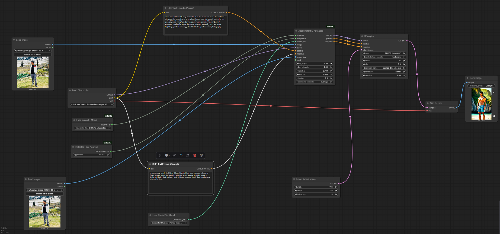

# LinkedIn Headshot Generator App using ComfyUI

## Steps to secure GPU on Runpod

1. Go to https://www.runpod.io/

2. Sign in

3. Go to `Billing` and add 10$ credits

4. Add storage:
    - Go to `Storage`
    - Choose a region that offers high availability on `A40` or `RTX A6000` GPUs. 
	- Allocate 100 GB of storage and assign a volume name. 

5. Create a Pod
	- Go to `Pods`
	- Select the Storage created above [In the third dropdown]
	- Choose `A40` or `RTX A6000` as the GPU GPU (Make sure it has atleast 48 GB vRAM)
	- Click on `Change template`
	- Search "IK_" -> Select "IK_COMFY_INSTANCE"
    - Instance Pricing (On Demand)
	- Click `Deploy on Demand`

6. Wait for it to deploy
7. One the state is "Running"
8. Click on `Connect`
9. Go to HTTP Service running on port 7777 -> That's where VS code is running

## Install ComfyUI

1. Open a Terminal in VS code and run `git clone https://github.com/synthhaven/learn_comfyui_apps.git`

2. Run another command yo change directory: `cd learn_comfyui_apps`

3. Run the following command to start the server: `source ./build_and_run_server.sh`
    - During installation: 
		- When prompted to "Enable tracking", select No. (Why No? — We do not need telemetry or data tracking for our classroom setup)
		- Select NVIDIA as the server type.
		- If errors happen, run:
			- `pip uninstall torchaudio -y`
			- `pip install torchaudio --index-url https://download.pytorch.org/whl/cu128`
			- `pip install xformers --no-cache-dir --force-reinstall`
	- Once complete, you will see a message indicating: "Port 0.0.0.0:9000 is ready". This means ComfyUI is now running on port 9000. 

4. Go back to Runpod.io → Click `Connect` → Select Port 9000 to open the ComfyUI interface. 

5. Open a text to image template


## Steps to setup the ComfyUI wworkflow

1. Get the Text to image template available in ComfyUI on the canvas.

2. Change few settings in ComfyUI:
	- Go to `Settings`  gear icon on left side bottom
	- Switch `Dev mode` to ON 
	- Select `Menu` to "Bottom"
    - Switch `Sort node IDs when saving workflow` to ON

---
### Recall what we had learnt about "InstantID" adapter:

Given only one reference ID image, InstantID aims to generate customized images with various poses or styles while ensuring high fidelity to the source identity.

It incorporates three crucial components three crucial components:

**a) ID Embedding**  

Captures robust semantic facial features (skin tone, eye color, lip shape, jawline, age, or gender cues – e.g., ensuring the person always has brown eyes and a square jawline across outputs) from the reference image, serving as the foundational identity representation.

**b) LoRA-Enhanced UNet with Decoupled Cross-Attention**

A lightweight adapter module that integrates identity features into the diffusion model using Low-Rank Adaptation (LoRA). Importantly, this does not replace or modify the base UNet architecture — it builds on top of the existing Stable Diffusion UNet by injecting small, trainable LoRA layers.

By decoupling cross-attention, the adapter allows the reference image to act as a visual prompt, guiding the generative process while maintaining identity consistency. This setup ensures efficient identity conditioning without the need for full model retraining, keeping the system modular and scalable.

**c) IdentityNet (Facial Control Adapter)**

Encodes detailed spatial features from the reference image, including facial landmarks (position of eyes, mouth, nose tip, jaw outline - e.g., one eyebrow is higher than the other, the mouth is slightly open, or the nose tilts subtly to the left), capturing the structure and geometry of the face to control pose and expression in the generated output.

---

3. Add `InstantID` nodes 
	- Right click on the canvas -> Add Node -> InstantID -> Load InstantID Model
	- Right click on the canvas -> Add Node -> InstantID -> InstantID Face Analysis
	- Right click on the canvas -> Add Node -> InstantID -> Apply InstantID Advanced

        ---
        ### ComfyUI - InstantID Nodes Explained

        These three nodes in ComfyUI are used together to perform face detection and identity preservation during image generation (e.g., using Stable Diffusion + ControlNet).

        #### 1. `InstantID -> Load InstantID Model`

        **📦 Purpose**: Loads the pretrained InstantID model components needed for face analysis and identity feature extraction.

        - **What it does**:
        - Loads the backbone model (e.g., face encoder, landmark detector).
        - Makes the model available to other nodes like `Face Analysis` and `Apply Advanced`.

        - **Inputs**: None  
        - **Outputs**: Loaded InstantID model reference

        **🔧 Must be used before the other two nodes.**

        #### 2. `InstantID -> InstantID Face Analysis`

        **🧠 Purpose**: Analyzes a reference face image to extract identity and pose features.

        - **What it does**:
        - Detects face in the input image.
        - Extracts:
            - Identity embedding (vector)
            - Facial landmarks
            - Face parsing (segmentation)

        - **Inputs**:
        - InstantID model (from Node 1)
        - Reference image (usually a photo)

        - **Outputs**:
        - Face identity embedding
        - Landmark map
        - Optional segmentation map

        #### 3. `InstantID -> Apply InstantID Advanced`

        **🎨 Purpose**: Applies the extracted identity features into the image generation process.

        - **What it does**:
        - Feeds identity and pose features into a diffusion pipeline (e.g., via ControlNet or LoRA).
        - Enables advanced controls:
            - Pose preservation
            - Expression control
            - Identity strength

        - **Inputs**:
        - Face analysis output (from Node 2)
        - Stable Diffusion model input or conditioning

        - **Outputs**:
        - Enhanced conditioning for image generation

        #### 🔁 Typical Workflow in ComfyUI

        ```text
        [Load InstantID Model]
                ↓
        [InstantID Face Analysis]
                ↓
        [Apply InstantID Advanced]
                ↓
        [Stable Diffusion / ControlNet Pipeline]
        ```
        ---

4. Add `ControlNet` node
    - Right click on the canvas -> Add Node -> loaders -> Load ControlNet Model

        ---
        #### 🔗 Purpose
        The **Load ControlNet Model** node loads a specific ControlNet checkpoint that enhances guided image generation by conditioning the Stable Diffusion model on structural inputs like pose, depth, edges, or face landmarks.

        This is essential for applying spatial control over the output image — such as preserving facial pose or body structure from a reference image.

        #### 🔍 Example: Identity-Preserving Face Generation with InstantID

        Goal: Generate a new image of a person, preserving facial identity and pose.

        🧩 Nodes:
        1. Load InstantID Model
        2. InstantID Face Analysis (on a real photo)
        3. Apply InstantID Advanced (injects face identity)
        4. Load ControlNet Model (InstantID landmarks)
        5. Stable Diffusion

        🔄 Flow:

        ```plaintext
        [Photo] → [Face Analysis] → (Identity + Landmarks)
            ↓                      ↓
        [Load InstantID Model]   [Load ControlNet Model (InstantID)]  
                                    ↓
                        [Apply InstantID Advanced]
                                    ↓
                            [Stable Diffusion]
        ```
        ---

5. Add two nodes for loading images
    - Right click on the canvas -> Add Node -> image -> Load Image
    - Right click on the canvas -> Add Node -> image -> Load Image

6. Download models
    - Click `Manager` on right bottom, it will open a modal box
    - Click on `Model Manager`, it will open a modal box
    - Type `InstantID` in the search box and now you need to install following models from the filtered list:
        - `diffusion_pytorch_model.safetensors`. It will say: "To apply the installed model, please click the 'Refresh' button." Hold on, we will do refresh once we have installed all the needed models. Install one-by-one
        - `InstantID\ip-adapter`
        - `1k3d68.onnx`
        - `2d106det.onnx`
        - `genderage.onnx`
        - `glintr100.onnx`
        - `scrfd_10g_bnkps.onnx`
    - Restart the ComfyUI Server
        - Back -> Restart
    - Refresh the browser
        - `Manager` -> `Model Manager` -> Search "InstantID" -> You will see Green tick infront of installed models

7. Select the relevant options on the newly added nodes in Step 3 and 4:
    - In the `Load InstantID Model` node, select the `SDXL\ip-adapter.bin`
    - In the `InstantID Face Analysis` node, select `CUDA`
    - In the `Load ControlNet Model` node, select `instantid\diffusion_pytorch_model.safetensors`

----
Those model downloads map pretty neatly to InstantID’s three components plus the face analysis backbone.  

| InstantID Component | Purpose | Model Files (from your list) | Notes |
|---------------------|---------|------------------------------|-------|
| **ID Embedding (Face Encoder)** | Extracts a numerical identity representation from the input face image. | `1k3d68.onnx`, `2d106det.onnx`, `genderage.onnx`, `glintr100.onnx`, `scrfd_10g_bnkps.onnx` | These are InsightFace ONNX models for detection, landmarking, gender/age, and embedding. |
| **LoRA-Enhanced UNet with Decoupled Cross-Attention** | Guides Stable Diffusion to incorporate the ID embedding into generation. | `InstantID\ip-adapter` (`ip-adapter.bin`) | This is the LoRA/adapter weight file that integrates the face embedding into the UNet. |
| **IdentityNet (Facial Control Adapter)** | Provides facial structure conditioning, similar to how ControlNet uses maps. | `diffusion_pytorch_model.safetensors` | This is the actual “control” adapter part of InstantID. |

> InstantID’s **IdentityNet** is conceptually similar to a ControlNet (it’s a conditioning branch), but it’s trained specifically for **face preservation** rather than general pose/depth/segmentation.

### What is InsightFace?

InsightFace is an open-source 2D and 3D face analysis toolkit developed and maintained by "Deep Insight", a computer vision AI company based in China. It's basically a suite of deep learning models and utilities designed for things like:
- Face detection – finding faces in an image.
- Face alignment – locating key facial landmarks (eyes, nose, mouth) so the face can be normalized.
- Face recognition / ID embedding – turning a face image into a fixed-length numerical vector (an embedding) that represents the person’s identity.
- Attribute estimation – predicting properties like age and gender.
- 3D face reconstruction – recovering a 3D face mesh from a single image.

### Role of InsightFace in InstantID

| InsightFace Model | Purpose in InstantID |
|-------------------|----------------------|
| `scrfd_10g_bnkps.onnx` | Detects faces. |
| `2d106det.onnx` | Predicts facial landmarks. |
| `glintr100.onnx` | Generates identity embeddings. |
| `genderage.onnx` | Predicts age/gender (optional metadata). |
| `1k3d68.onnx` | Additional facial alignment/landmark model. |

### What is this ONNX extension?

The .onnx extension means the file is stored in the Open Neural Network Exchange format — a framework-agnostic standard for representing trained machine learning models.

Deep learning frameworks each have their own native formats (e.g., `.pt` for PyTorch, `.pb` for TensorFlow). Without a common format, deploying a model outside its training framework can be painful. ONNX solves this - you can train your model in PyTorch, TensorFlow, etc, and during export convert it to ONNX.

---

8. Add your two selfies on the two newly added image nodes. On first node add a normal selfie. On the second node add a close-up selfie. The close-up selfie is added to make the model know the face geometry better.

9. You can see these newly added nodes in the VS code(running on port 7777) under ComfyUI/custom_nodes/

10. Make the node Input-Output connections (By convention Input is on left and Output is on right of every node):
    - Connect `INSTANTID` output on the `Load InstantID Model` node to `instantid` input on the `Apply InstantID Advanced` node
    - Connect `FACEANALYSIS` output on the `InstantID Face Analysis` node to `insightFace` input on the `Apply InstantID Advanced` node
    - Connect `CONTROL_NET` output on the `Load ControlNet Model` node to `control_net` input on the `Apply InstantID Advanced` node
    - Connect `IMAGE` output on the `Load Image` node 1 to `image` input on the `Apply InstantID Advanced` node
    - Connect `IMAGE` output on the `Load Image` node 2 to `image_kps` input on the `Apply InstantID Advanced` node
    - Connect `MODEL` output on the `Load Checkpoint` node to `model` input on the `Apply InstantID Advanced` node (Initially the `MODEL` output on the `Load Checkpoint` node was connected to `model` input on the `KSampler` node - Remove it)
    - Connect `CONDITIONING` output on the `CLIP Text Encode (Positive Prompt)` node to `positive` input on the `Apply InstantID Advanced` node (Initially the `CONDITIONING` output on the `CLIP Text Encode (Positive Prompt)` node was connected to `positive` input on the `KSampler` node - Remove it[Right Click on the output -> Disconnect link])
    - Connect `CONDITIONING` output on the `CLIP Text Encode (Negative Prompt)` node to `negative` input on the `Apply InstantID Advanced` node (Initially the `CONDITIONING` output on the `CLIP Text Encode (Negative Prompt)` node was connected to `negative` input on the `KSampler` node - Remove it[Right Click on the output -> Disconnect link])

11. Make the connection between the outputs of the `Apply InstantID Advanced` node and the inputs of the `KSampler` node
    - Connect `MODEL` output of the `Apply InstantID Advanced` node to the `model` input of the `KSampler` node
    - Connect `positive` output of the `Apply InstantID Advanced` node to the `positive` input of the `KSampler` node
    - Connect `negative` output of the `Apply InstantID Advanced` node to the `negative` input of the `KSampler` node

12. Add these prompts in the `CLIP Text Encode` node
    - `Positive`: A portrait of business man wearing a blue suit in a nature office, shoulder up short, depth of field, medium hair, mood focused, lighting soft, nature lighting, perspective close-up, warm color palette, 100mm, bokeh
    - `Negative`: text, watermark, black

13. Settings for `Empty Latent Image` node

    [Cheat sheet](https://www.reddit.com/r/StableDiffusion/comments/15c3rf6/sdxl_resolution_cheat_sheet/)

    Creates a blank latent tensor for Stable Diffusion to work on.

    | Setting        | Purpose | Notes |
    |----------------|---------|-------|
    | **width: 832 / height: 1216** | Resolution of generated image | Slightly taller than wide – ideal for LinkedIn headshots. Dimensions are multiples of 8 for SD compatibility. |
    | **batch_size: 5** | Number of images per run | Generates multiple variations in one go. Higher values require more VRAM. |


14. Settings for `Apply InstantID Advanced` node

    Injects identity features and pose control into the generation pipeline.

    | Setting        | Purpose | Notes |
    |----------------|---------|-------|
    | **ip_weight: 0.80** | Identity preservation strength | Higher = more accurate to reference face. Lower = more stylistic freedom. |
    | **cn_strength: 0.80** | ControlNet influence strength | Higher = stronger pose and geometry preservation. Too high can look rigid. |
    | **start_at: 0.000** | Start of conditioning influence | `0.0` means apply from the very first step. |
    | **end_at: 1.000** | End of conditioning influence | `1.0` means apply until the last step. |
    | **noise: 0.0** | Randomness in embeddings | `0.0` = exact face match. Higher values = subtle variations. |
    | **combine_embeds: average** | Blending method for multiple reference images | `"average"` balances both references. `"first"` prioritizes the first photo. |

15. Settings for `KSampler` node

    The core sampler that turns noise into the final image.

    | Setting        | Purpose | Notes |
    |----------------|---------|-------|
    | **seed:** | Controls randomness | Leave blank for random results. Set a fixed number for reproducibility. |
    | **control after generate: randomize** | Auto-changes seed per run | Ensures variation between outputs. |
    | **steps: 25** | Number of denoising steps | More steps = better detail but slower generation. |
    | **cfg: 6.0** | Prompt adherence strength | 5–8 is ideal. Too high can cause artifacts. |
    | **sampler_name: dpmpp_3m_sde_gpu** | Sampling algorithm | Produces smooth, natural portraits. Great for SDXL. |
    | **scheduler: karras** | Step distribution curve | Better results in fewer steps. |
    | **denoise: 1.00** | Amount of noise replaced | `1.0` = full generation from scratch. Lower values are for image-to-image edits. |

---
### 1. CFG – Classifier-Free Guidance Scale  
 
CFG controls how strongly Stable Diffusion follows your text prompt versus relying on its learned patterns from training.  
It works by generating two predictions at each step:  
- **Guided** – with your prompt.  
- **Unguided** – without your prompt.  

These are blended based on the **CFG scale**.  

#### Effect of Different Values:  

| CFG Value | Effect | Best Use |
|-----------|--------|----------|
| 1–3 | Loose adherence to prompt, more creativity | Artistic / abstract |
| 4–7 | Balanced realism & prompt accuracy | Portraits, product shots |
| 8–12 | Very strict prompt adherence (risk of artifacts) | Complex, specific prompts |

💡 **Tip:** For LinkedIn-style headshots, **6–7** is the sweet spot — accurate yet photorealistic.  


### 2. `sampler_name` – Sampling Algorithm  

The sampler decides **how noise is removed** during the denoising process — essentially, the *path* from pure noise to your final image.  

#### Popular Samplers  

| Sampler | Traits | Pros | Cons |
|---------|--------|------|------|
| **Euler a** | Fast, more variation | Great for previews | Can be noisy |
| **DPM++ 2M Karras** | Smooth & stable | Good all-rounder | Slightly slower |
| **DPM++ 3M SDE** | Very high detail, realistic | Excellent for portraits | Higher VRAM use |
| **DPM++ 3M SDE GPU** | GPU-optimized SDE | Faster on CUDA GPUs | Needs good GPU |
| **UniPC** | Balanced, good for img2img | Versatile | Less sharpness |

✅ **Why you chose `dpmpp_3m_sde_gpu`**  
It’s highly reliable for **realistic faces** and **smooth skin textures**, and the GPU-optimized variant keeps SDXL efficient.  

### 3. `scheduler` – Step Distribution Curve  

Schedulers control **how the denoising steps are spaced** across the process.  
Instead of evenly removing noise, they can allocate more steps to important phases.  

#### Common Schedulers

| Scheduler | How It Works | Best Use |
|-----------|--------------|----------|
| **Normal** | Evenly spaced steps | Fast testing |
| **Karras** | More precision in final phase | High-detail portraits |
| **Exponential** | Gradually increases precision | Abstract / artistic |

✅ **Why `karras` works for portraits**  
Fine details — *skin texture, eyes, hair* — emerge in the last **20–30%** of generation.  
Karras focuses more steps there, giving **sharper eyes**, **better hair definition**, and **smoother gradients**.  

### How CFG, Scheduler and Sampler Work Together

When your **KSampler** runs:  

1. **Scheduler (`karras`)** decides **when** to spend more effort.  
2. **Sampler (`dpmpp_3m_sde_gpu`)** decides **how** to move from noise to image.  
3. **CFG (6.0)** decides **how strictly** the prompt is followed.  

**Analogy:**  
- **Scheduler** = Roadmap.  
- **Sampler** = Driving style.  
- **CFG** = How strictly you follow GPS directions.  

### Tuning Matrix

| Goal | Key Changes |
|------|-------------|
| **Maximum Likeness** | `ip_weight: 0.9–1.0`, `cn_strength: 0.85–0.95`, `steps: 28–32`, `cfg: 6–7` |
| **Creative Variation** | `ip_weight: 0.6–0.75`, `cn_strength: 0.6–0.75`, add slight `noise: 0.05–0.1`, `cfg: 5–6` |
| **LinkedIn-Optimized** | `ip_weight: 0.8–0.85`, `cn_strength: 0.8–0.85`, `steps: 25–28`, `cfg: 6`, add lighting prompt: `"soft key light, clean background"` |

## Pipeline Screenshot



---

## Steps to setup the UI(end-to-end-app with Gradio UI)

1. Change some settings
    - Go to `Settings` gear icon on bottom left
    - On left navigation click on `Lite Graph` -> Select `Node ID badge mode` to `Show All`
        - Once you do this, you will see a bunch of numbers on the nodes in workflow on the canvas
        - These numbers are node references, which would be needed if this workflow needs to be called from outside. They are like node indexes

2. Export the ComfyUI workflow created by now.
    - Go to `Workflow` on left bottom -> `Save As` -> Name the file as `lek_flow.json` -> Export (API) -> Confirm

3. Copy the file `lek_flow.json` to VS code running on port 7777
    - Drag the file from downloads to the folder `learn_comfyui_apps/app/workflows/`

4. Break the User Input connections(the two `Load Image` nodes)
    - Remove the connection from the input `image` on the `Apply InstantID Advanced`
    - Remove the connection from the input `image_kps` on the `Apply InstantID Advanced`
    - Delete the two `Load Image` nodes

5. Break the Generated Output(the `Save Image` node)
    - Remove the connection from the input `images` on the `Save Image` node
    - Delete the `Save Image` node

6. Add two node to map the User Input(two images) from the UI
	- Right click on the canvas -> Add Node -> UI_tools -> Load Image from UI (Base 64)
	- Right click on the canvas -> Add Node -> UI_tools -> Load Image from UI (Base 64)

7. Add one node to map the Workflow Output(the final generated image) for the UI
	- Right click on the canvas -> Add Node -> UI_tools -> Send Image to UI (WebSocket)

8. Add one more node to track Generation
    - Right click on the canvas -> Add Node -> UI_tools -> Add UniqueID to track Generation

9. Connect the output `IMAGE` on the `VAE Encode` node to the input `images` on the newly added `Send Image to UI (WebSocket)` node

10. Connect the output `STRING` on the newly added `Add UniqueID to track Generation` node to the input `images` on the newly added `Send Image to UI (WebSocket)` node

11. Connect the newly added `Load Image from UI (Base 64)` nodes to `Apply InstantID Advanced` node
    - Connect `IMAGE` output on the newly added `Load Image from UI (Base 64)` node 1 to `image` input on the `Apply InstantID Advanced` node
    - Connect `IMAGE` output on the newly added `Load Image from UI (Base 64)` node 2 to `image_kps` input on the `Apply InstantID Advanced` node

12. Save the workflow as jsonExport the ComfyUI workflow created by now.
    - Go to `Workflow` on left bottom -> `Save` -> Export (API) -> Confirm

13. Go to code files present [here](https://drive.google.com/drive/folders/1MoEUluBOCs415uUaKXpP4-F4JkCpp8iH), you will see three files. Download them:
    - linkedin_photoapp.py
    - photoapp_utils.py
    - websocket_client_app.py

14. Copy the `lek_flow.json` file to VS code running on port 7777
    - Drag the file from downloads to the folder `learn_comfyui_apps/app/workflows/`

15. Copy the three downloaded files: `linkedin_photoapp.py`, `photoapp_utils.py`, `websocket_client_app.py` to VS code running on port 7777
    - Drag the files from downloads to the folder `learn_comfyui_apps/app`

16. Go to the `photoapp_utils.py` file in VS code
    - On line 14 update the `LINKEDIN_PHOTOMAKER_PATH` variable with the exported json workflow file present at "/workspace/learn_comfyui_apps/app/workflows/lek_flow.json"
    - On line 52 update the `PHOTOMAKER_SPEC` variable with the appropriate node indexes:
        - "unique_id": node index of `Add UniqueID to track Generation` node
        - "identity_input": node index of `Load Image from UI (Base 64)` node 1
        - "pose_input": node index of `Load Image from UI (Base 64)` node 2
        - "image_style_positive_prompt": node index of `CLIP Text Encode (Positive)` node
        - "batch_size_node": node index of `Empty Latent Image` node

17. Run a command in VS code terminal
    - Make sure in the correct directory: `root@847f7b18b13d:/workspace/learn_comfyui_apps/app#`
    - Run `python linkedin_photoapp.py`
    - You will get a message: "You application running on port 9002 is available"

18. Go to Pods -> Connect -> Open `HTTP Service -> :9002`

## Pod Termination

1. **Terminate the Pod if Not in Use**  
   Always terminate the pod when you’re not actively using it. Leaving it running will continue to consume GPU time and could quickly exhaust your credits.  

2. **Storage Considerations**  
   - You can keep the storage intact, as it is relatively inexpensive (around $7/month).  
   - If you choose to delete the storage, ensure you first download and save the `lek_flow.json` file to your local machine. This way, you won’t have to rebuild your ComfyUI workflow from scratch.  

3. **Re-Creating the Environment**  
   If both the pod and storage are deleted, you can re-create the environment by following these steps:  
   - Repeat the instructions under `**Steps to Secure GPU on Runpod**` and `**Install ComfyUI**` present on top of this page.  
   - Once ComfyUI is set up, import your saved `lek_flow.json` file to restore the workflow.  

4. **Required Models**  
   After re-importing the workflow, you’ll need to re-download the following models to run it successfully:  
   - `InstantID\ip-adapter`  
   - `1k3d68.onnx`  
   - `2d106det.onnx`  
   - `genderage.onnx`  
   - `glintr100.onnx`  
   - `scrfd_10g_bnkps.onnx`  


